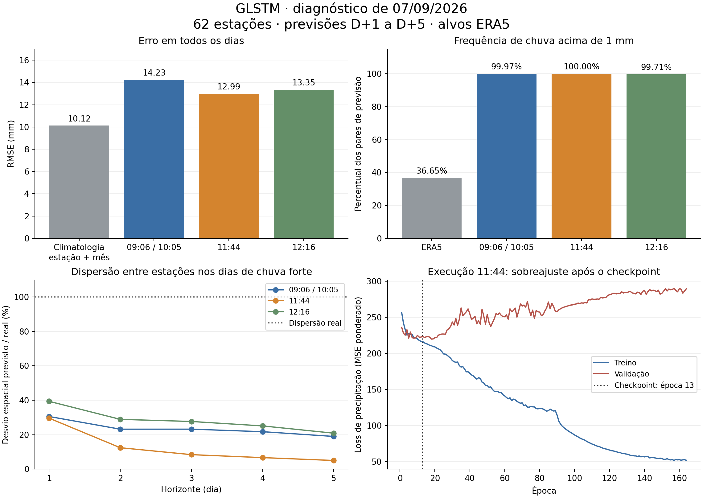

**Auditoria do pipeline `src/run_experiment.py` — 07/09/2026**

O principal problema observado é a combinação de previsões com viés positivo, pouca discriminação entre dias secos e chuvosos e subestimação dos extremos. Há conflito entre a loss usada no treinamento e o critério que seleciona o checkpoint. A configuração gaussiana mais recente praticamente desativa a comunicação espacial. Aumentar épocas ou dimensão oculta, isoladamente, não é a primeira intervenção indicada pelas evidências.

A auditoria seguiu [AGENT.md](../AGENT.md), examinou dados, fontes, históricos, checkpoints e CSVs de `Experiments/run_experiment/07_09_2026`. As quatro execuções estavam completas ao finalizar a análise; a execução das 12:16 terminou durante a auditoria. Nenhuma fonte do pipeline nem output original foi alterado; nenhum experimento foi treinado por esta auditoria. Foram criados somente este relatório, a figura e pequenos scripts/tabelas de diagnóstico.

**Base quantitativa**

Cada execução contém 583.110 pares de previsão: 1.881 origens × 5 horizontes × 62 estações, com datas-alvo de 03/11/2020 a 31/12/2025. As quatro execuções têm exatamente os mesmos alvos datados. A agregação abaixo trata cada horizonte como uma previsão distinta; as contagens não representam dias meteorológicos independentes. A precipitação média real é 4,419 mm. Os baselines de climatologia usam exclusivamente o bloco de treino de 01/01/2000 a 07/08/2015.

| Execução / baseline | RMSE todos os dias (mm) | MAE todos os dias (mm) | R² todos os dias | Média prevista (mm) | RMSE quando alvo >35 mm |
|---|---:|---:|---:|---:|---:|
| 09:06 e 10:05 | 14,226 | 12,152 | -0,965 | 13,528 | 39,134 |
| 11:44 | 12,991 | 11,283 | -0,638 | 12,574 | 39,974 |
| 12:16 | 13,355 | 11,056 | -0,731 | 12,150 | 40,516 |
| Média de treino por estação | 10,131 | 6,087 | 0,004 | 4,582 | 49,386 |
| Média de treino por estação e mês | 10,122 | 6,075 | 0,005 | 4,594 | 49,268 |

O GLSTM melhora o erro condicional dos extremos em relação à climatologia, mas piora substancialmente o erro global. Isso não equivale a detectar bem os eventos: elevar a previsão de todos os dias também melhora o RMSE calculado somente onde choveu muito. As execuções 09:06 e 10:05 têm checkpoints iguais em todos os tensores e CSVs com SHA256 idêntico; representam o mesmo modelo selecionado na época 196, apesar das diferentes durações de treino.

**1. Prioridade alta — seleção do checkpoint ignora quase todo o regime de precipitação. Confirmado.**

Em [Training_Routines.py:98](../src/Training/Training_Routines.py), `METRIC_STANDARD='modified'` transforma o monitor solicitado `loss` em RMSE filtrado. A seleção em `:181` usa somente `y_true > 35`, e o checkpoint em `:676` acompanha esse monitor. No teste, apenas 14.492 de 583.110 pares são elegíveis: 2,485%. Os erros nos demais 97,515%, incluindo chuva prevista em dias secos, não entram nessa seleção.

Nas execuções 09:06/10:05, o checkpoint tem loss de validação 282,419, embora exista época com loss 244,350: a seleção aceita uma loss 15,6% maior. No run 12:16, escolhe a época 36, loss 267,468, enquanto a menor loss é 245,365 na época 19. A restauração do checkpoint funciona; o problema é o objetivo escolhido, se a finalidade é aprender o regime completo.

O resultado prático é forte: chuva >1 mm ocorre em 36,65% dos alvos, enquanto as previsões excedem 1 mm em 99,97%, 100% e 99,71% dos casos, respectivamente nos modelos 09:06/10:05, 11:44 e 12:16. Nos dias com alvo <=1 mm, a média prevista continua entre 11,57 e 12,95 mm. Os três primeiros runs nunca preveem >35 mm. O run 12:16 acerta 104 dos 14.492 pares com alvo >35 mm: recall de 0,718%, com 1.442 falsos alarmes e precisão de 6,73%.

Recomendação: separar métricas globais, métricas de ocorrência e métricas condicionais dos extremos. Para uma primeira referência do regime completo, selecionar por loss/RMSE global e continuar registrando recall, precisão, CSI e viés para limiares de chuva. Se o objetivo prioritário forem extremos, o critério precisa considerar também falsos alarmes. O recorte atual é válido como diagnóstico condicional, mas insuficiente como único monitor.

**2. Prioridade alta — a ponderação da loss desloca a previsão para cima. Mecanismo confirmado; contribuição causal precisa de ablação.**

[QuantileMSELoss](../src/Training/experiment_runner.py:153) é MSE ponderado por faixas do alvo, não uma loss de previsão de quantis probabilísticos. Os limites efetivos são 0,300 e 15,209 mm, com pesos 0,414 / 0,517 / 2,069. Toda chuva acima de 15,2 mm recebe aproximadamente cinco vezes o peso do primeiro grupo; não há faixa específica em 35 mm. O limite configurado de peso 50 não está ativo.

Como referência algébrica, no alvo bruto do treino a constante ótima para MSE comum é 4,582 mm; para esses pesos fixos globais, `sum(w*y)/sum(w)` é 10,981 mm. Isso ilustra como um preditor com pouca informação discriminante pode reduzir a loss prevendo chuva moderada quase sempre. Não é a solução exata da loss executada, pois o código também normaliza os pesos pela média de cada batch.

`SHUFFLE_TRAIN=False` e a normalização por batch fazem a escala relativa dos exemplos depender da composição de períodos secos/chuvosos. O GLSTM reinicia H/C em cada `forward` ([model.py:379](../src/Models/model.py)); não há estado entre batches que obrigue a ordem cronológica. Testar MSE comum primeiro, depois ponderação moderada com normalização global e batches embaralhados, mantendo o split temporal, permite medir esse efeito.

**3. Prioridade alta — sigma de 1 km torna o grafo quase identidade no run 12:16. Confirmado.**

[run_experiment.py:108](../src/run_experiment.py) configura `gaussian` com sigma de 1 km. As 388 entradas dirigidas do KNN correspondem a distâncias de 4,69 a 224,41 km, mediana 75,57 km. Em [graph_related_utils.py:289](../src/Graph/graph_related_utils.py), todos os pesos gaussianos acabam no piso `1e-4` aplicado em `:305`; portanto o prior perde também a distinção entre distâncias.

No checkpoint 12:16, a diagonal normalizada mediana é 0,999379 e a soma mediana das entradas fora da diagonal é apenas 0,0006215. Há pouquíssima troca espacial. Os pesos brutos aprendidos permanecem entre 0,0000876 e 0,0001279. A parametrização `prior * exp(logit)` ([model.py:209](../src/Models/model.py)) também interage com o clamp padrão dos logits em ±6 ([Training_Routines.py:386](../src/Training/Training_Routines.py)): com prior `1e-4`, o teto por aresta fica aproximadamente 0,0403, contra self-loop fixo 1.

Esse achado se aplica ao run 12:16 e ao código atual. Os outros três checkpoints não contêm o prior explícito e usam a parametrização sigmoid anterior, com arestas medianas próximas de 0,5. Não é correto atribuir os erros antigos ao sigma atual. A nova execução também registra regularização de ancoragem da adjacência ausente nos resumos antigos; a comparação entre versões não isola somente o sigma.

Recomendação: verificar a distribuição dos pesos e o peso efetivo do próprio nó antes de treinar. Comparar identidade, pesos unitários e um sigma derivado das distâncias KNN, fixando as demais condições. A mediana das distâncias é um ponto inicial verificável, não um hiperparâmetro já validado.

**4. Prioridade alta — perda de contraste espacial; `LEARN_STD` não a restringe diretamente. Confirmado no resultado; causa arquitetural ainda precisa de ablação.**

Nos modelos antigos, a diagonal normalizada mediana é aproximadamente 0,25 e a soma mediana das entradas de vizinhos é aproximadamente 0,75. Como a normalização é simétrica, essas quantidades não são probabilidades nem somam exatamente 1 em todas as linhas. [GLSTMCell_v2.forward](../src/Models/model.py:245) mistura tanto o estado oculto H quanto a memória C a cada passo; a atualização conserva `F * C_graph`, sem uma rota separada para `F * C_local`. Essa difusão recorrente é uma hipótese plausível para perda de contraste.

No run 11:44, a razão entre o desvio espacial médio previsto e o real cai de 76,4% em D+1 para 16,2% em D+5. Restringindo aos dias em que pelo menos uma estação supera 35 mm, a retenção em D+5 é apenas 5,0%. No run 12:16, quase sem mistura espacial, a retenção em D+5 melhora para 64,9% no conjunto inteiro e 20,8% nos dias fortes, mas o RMSE global continua pior que a climatologia. Portanto oversmoothing não explica sozinho o fracasso.

[model.py:369](../src/Models/model.py) calcula chuva e desvio padrão por cabeças distintas. A loss auxiliar em [Training_Routines.py:545](../src/Training/Training_Routines.py) compara `pred_std` com `std(y)`, sem impor `std(pred_chuva) = std(y)`. No run 11:44 a cabeça auxiliar tem média 4,722 mm, ante 4,112 mm reais, enquanto as previsões de chuva quase não distinguem as estações em D+5. Seu R² auxiliar é apenas 0,081.

Recomendação: primeiro medir uma ablação com `LEARN_STD=False`. Se o objetivo da regularização for preservar contraste, avaliar uma penalidade diretamente nas previsões, com coeficiente explícito, e uma mistura que preserve memória local. Igualar apenas o desvio não garante posicionar a chuva nas estações corretas; é necessário conferir erro por estação e padrão espacial dos eventos.

**5. Prioridade alta para o objetivo INMET — o alvo é ERA5 nas coordenadas do catálogo. Confirmado.**

[load_station_catalog](../src/Data/temporal_dataset.py:171) lê nomes/coordenadas do INMET. [grid_dataset_to_station_features](../src/Data/temporal_dataset.py:221) amostra o grid por `nearest`, e [build_station_feature_dataset](../src/Data/temporal_dataset.py:335) define `y` como o próprio `tp` ERA5. O runner não carrega séries observadas de precipitação dos pluviômetros.

Assim, os outputs medem habilidade de prever a reanálise nos pontos do catálogo, e não habilidade contra observações INMET. Duas duplas têm alvos exatamente iguais porque compartilham uma célula de 0,25°: BAGE/BAGE - CENTRO e CHARQUEADAS/PARQUE ELDORADO. Isso limita a informação sobre diferenças locais disponível ao aprendizado. Se o objetivo é precipitação observada nas estações, é necessário construir alvos INMET com controle de qualidade e máscara de disponibilidade, preservando ERA5 como entrada quando apropriado. Caso o objetivo seja explicitamente ERA5 nos pontos INMET, a construção é coerente, mas a interpretação deve usar esse escopo.

**6. Prioridade média — janela diária da precipitação deslocada uma hora em relação ao dia UTC. Confirmado.**

[forecast_steps_to_daily_precip](../src/Data/feature_extraction.py:430) reconstrói corretamente `time + step`, mas soma os horários válidos 00:00–23:00 em `:438`. No ERA5 horário, o acumulado válido em uma hora representa a hora anterior; essa semântica está documentada pela [ECMWF](https://confluence.ecmwf.int/spaces/CKB/pages/85402030/). Consequentemente, para representar o dia UTC 00:00–24:00, a soma deve incluir os valores válidos 01:00–23:00 e 00:00 do dia seguinte. O agregado atual corresponde a 23:00 do dia anterior até 23:00 do dia indicado.

A correção foi quantificada sem modificar o cache: em 2024 × 62 estações, a diferença absoluta média é 0,322 mm, o percentil 95 é 1,841 mm e o máximo é 23,769 mm. Em 9,36% dos estação-dias a diferença passa de 1 mm; 75 de 22.692 pares mudam de classe em 35 mm. O efeito médio é menor que o viés atual do modelo, mas alguns eventos são afetados materialmente. O fechamento de um dia observacional INMET também precisa ser explicitamente alinhado; não se deve assumir que coincida com UTC.

Uma correção exige recalcular/versionar o cache diário de precipitação, conferir bordas de data e retreinar, pois `USE_DAILY_CACHE=True` reutiliza os agregados existentes. Não basta editar a função e repetir a execução com o mesmo cache.

**7. Prioridade média — sobreajuste e hiperparâmetros de otimização confundidos. Confirmado para sobreajuste; LR/clipping são hipóteses.**

No run 11:44, da época selecionada 13 à final 164, a loss de precipitação no treino cai de 216,27 para 51,71, enquanto a de validação sobe de 224,04 para 289,48. No run 12:16, da época 36 à 187, treino cai de 190,71 para 51,43 e validação sobe de 237,04 para 285,99. O export restaura corretamente o melhor checkpoint; os campos `last_*` do resumo descrevem a última época, não o modelo exportado.

LR base 0,01, LR da adjacência até 0,05 e paciência do scheduler `patience//2` ([Training_Routines.py:446](../src/Training/Training_Routines.py)) merecem uma comparação controlada. Não há nos históricos norma de gradiente antes do clipping, fração de passos cortados, saturação das células ou LR por época; não é possível afirmar que clipping ou saturação sejam a causa. Entre os runs antigos, fator da LR da adjacência e clipping mudaram juntos de 1 para 5. Aumentar épocas já mostrou prolongar sobreajuste sem melhorar o checkpoint.

**Verificações favoráveis e limites**

O split cronológico antecede a criação das janelas ([temporal_dataset.py:440](../src/Data/temporal_dataset.py)), as janelas ficam dentro de cada bloco, e os scalers são ajustados apenas no treino ([temporal_dataset.py:565](../src/Data/temporal_dataset.py)). Não foi encontrado vazamento de alvos entre os blocos nesse caminho. A série de precipitação amostrada tem 9.497 dias × 62 estações e nenhum NaN. As proporções de extremos e médias gerais dos blocos são relativamente próximas; isso não exclui mudanças regionais/sazonais, mas não sustenta uma mudança grosseira de escala como causa dominante.

Passaram os 17 testes existentes de adjacência compartilhada e os 7 testes da cabeça `LEARN_STD`, além da compilação sintática de todas as fontes Python de `src/`. Esses checks verificam contratos e comportamento implementado; não validam habilidade meteorológica nem eliminam os problemas de objetivo/configuração descritos acima. Os links locais do relatório e os hashes das fontes também foram verificados.

As entradas usam somente o histórico de 15 dias, com estatísticas diárias em pontos locais e saída direta de cinco dias. A lista de features não contém previsões atmosféricas futuras, calendário explícito ou campos espaciais amplos. A insuficiência de informação para localizar eventos em D+3–D+5 é uma hipótese adicional; deve ser avaliada depois de estabelecer habilidade em D+1. Não é possível inferir um limite físico de previsibilidade a partir destes runs.

**Sequência recomendada de próximos experimentos**

1. Definir o alvo científico, alinhar o fechamento diário e versionar os dados resultantes; preservar os outputs atuais como referência.
2. Estabelecer uma referência em D+1 com MSE comum, monitor global e métricas separadas de ocorrência/extremos. Comparar com climatologia de treino e persistência.
3. Isolar o efeito espacial: identidade, KNN fixo e KNN aprendido com pesos numa escala compatível com as distâncias. Manter a mesma loss, seed, seleção e duração máxima; repetir depois com outras seeds.
4. Isolar loss ponderada e cabeça auxiliar, alterando um componente por vez. Avaliar falsos alarmes, viés, extremos e dispersão espacial, além de RMSE.
5. Ajustar LR/paciência com registro dos gradientes e do LR; ampliar o horizonte apenas após demonstrar ganho estável em D+1. Fazer a escolha na validação e reservar o teste para avaliação final.

**Evidências reproduzíveis**

Os scripts estão em [tmp/audit_07_09_2026](../tmp/audit_07_09_2026). Executar na raiz, nesta ordem: `python -B tmp/audit_07_09_2026/inspect_pipeline.py`, `python -B tmp/audit_07_09_2026/analyze_outputs.py` e `python -B tmp/audit_07_09_2026/plot_diagnostics.py`. Eles leem os dados/modelos existentes e escrevem somente artefatos da auditoria. As funções de estatística usam erro `previsto - real`; o CSV original usa a convenção oposta para `residual`.

- [Métricas globais, por horizonte e regime](../tmp/audit_07_09_2026/forecast_metrics.csv).
- [Detecção de eventos e falsos alarmes](../tmp/audit_07_09_2026/event_detection.csv).
- [Baselines calculados apenas no treino](../tmp/audit_07_09_2026/baseline_metrics.csv). A persistência exclui a primeira origem, cuja observação anterior não consta do CSV, e usa 582.800 pares; as climatologias e os modelos usam todos os 583.110.
- [Dispersão espacial](../tmp/audit_07_09_2026/spatial_dispersion.csv), [inspeção de checkpoints](../tmp/audit_07_09_2026/checkpoint_inspection.json) e [inspeção dos dados](../tmp/audit_07_09_2026/data_inspection.json).
- [Resumo e hashes dos CSVs](../tmp/audit_07_09_2026/output_summary.json) e [hashes das fontes auditadas](../tmp/audit_07_09_2026/source_sha256.json). As versões exatas das fontes usadas nos runs antigos não foram preservadas nos artefatos examinados; as conclusões históricas priorizam config, tensores e resultados efetivamente salvos.
