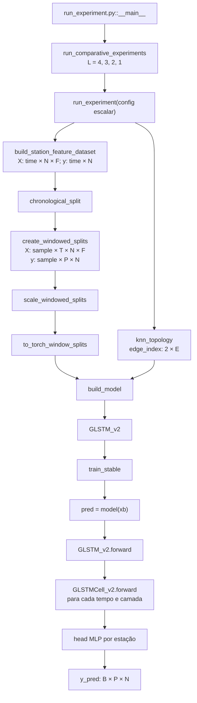

# Mapa do GLSTM usado por `run_experiment`

Este documento descreve o caminho efetivamente mantido no código-fonte atual, desde a preparação dos dados até a saída do `forward`. O foco é o ramo `MODEL_TYPE = "glstm"` de [`src/run_experiment.py`](src/run_experiment.py#L94), que instancia `GLSTM_v2`; `GLSTM_v1` é uma implementação legada e não participa desse fluxo.

Os números concretos abaixo refletem o catálogo e os caches presentes no workspace em 30/08/2026. O contrato do código continua dinâmico: `N` e `F` são inferidos dos tensores, portanto podem mudar se estações, variáveis ou níveis meteorológicos mudarem.

## 1. Resumo executivo

Ao executar `python src/run_experiment.py`, a configuração atual não treina um único modelo. Como `COMPARATIVE_RUN = True` e `LSTM_LAYERS = [4, 3, 2, 1]`, o ponto de entrada cria quatro execuções de `GLSTM_v2`, variando apenas a profundidade recorrente ([`run_experiment.py:77-128`](src/run_experiment.py#L77), [`run_experiment.py:608-713`](src/run_experiment.py#L608)).

Cada modelo recebe uma janela histórica e prevê todos os dias do horizonte de uma só vez:

```text
entrada X       [B, 15, 62, 25]
                      │
              GLSTM_v2 com H=128
                      │
saída y_pred    [B,  5, 62]
```

Legenda usada no restante do documento:

| Símbolo | Significado | Valor atual |
|---|---|---:|
| `B` | tamanho real do batch | até 64 |
| `T` | comprimento da janela histórica | 15 dias |
| `N` | número de nós/estações | 62 |
| `F` | número de atributos por estação/dia | 25 |
| `D` | dimensão de entrada de uma célula | `F` na primeira camada; `H` nas demais |
| `H` | dimensão escondida | 128 |
| `P` | horizonte de previsão | 5 dias |
| `L` | número de camadas GLSTM | 4, 3, 2 ou 1, conforme o run |

Configuração de cada run no código atual:

| Aspecto | Valor efetivo |
|---|---|
| classe | `Models.model.GLSTM_v2` |
| grafo-base | kNN com `k=15`, convertido para não direcionado |
| adjacência | única e compartilhada pelas camadas; aprendível (`learn_adj=True`) e restrita às arestas-base (`lock_topology=True`) |
| clipping da célula | `cell_clip=5.0`, valor default não exposto em `ExperimentRunConfig` |
| dropout | `0.3`, somente no head de saída |
| normalização | `StandardScaler` nas features; target sem normalização |
| loss | MSE |
| saída | previsão direta `[B, P, N]`, sem ativação final |

Com `N=62`, `F=25`, `H=128` e `P=5`, as contagens de parâmetros treináveis são:

| `L` | Células `GLSTMCell_v2` | Parâmetros treináveis |
|---:|---:|---:|
| 1 | 1 | 108.297 |
| 2 | 2 | 240.393 |
| 3 | 3 | 372.489 |
| 4 | 4 | 504.585 |

Essas contagens incluem uma única matriz densa treinável `a_logits [N,N]`, referenciada por todas as células. Com a topologia bloqueada, posições fora do kNN continuam registradas no parâmetro, mas são multiplicadas por zero no `forward` e não influenciam a saída.

## 2. Mapa da execução



O encadeamento principal está em [`run_experiment.py:385-605`](src/run_experiment.py#L385). A escolha de `GLSTM_v2` ocorre em [`Training/experiment_runner.py:99-118`](src/Training/experiment_runner.py#L99).

## 3. Como a entrada do modelo é formada

### 3.1 Features e target

`build_station_feature_dataset` amostra as grades meteorológicas no ponto mais próximo de cada estação, alinha os tempos e concatena tudo em `X [time, station, feature]`. O target `y [time, station]` é a precipitação diária `tp` ([`temporal_dataset.py:248-376`](src/Data/temporal_dataset.py#L248)).

Com os switches atuais, as 25 features são:

| Grupo | Construção | Quantidade |
|---|---|---:|
| precipitação | `tp` diária, também usada como target futuro | 1 |
| temperatura/orvalho | média, mínimo e máximo de `t2m` e `d2m` | 6 |
| umidade específica | máximo, média e mínimo de `q` em 1000 e 850 hPa | 6 |
| velocidade vertical | máximo, média, mínimo e p10 de `w` em 850, 500 e 300 hPa | 12 |
| vento horizontal | desligado na configuração atual | 0 |

Dimensões meteorológicas adicionais, como nível de pressão, são achatadas no eixo `feature` por [`grid_dataset_to_station_features`](src/Data/temporal_dataset.py#L142). Por isso `F` não é fixado dentro do modelo.

### 3.2 Split, janelas e escala

O split cronológico é feito antes do janelamento, evitando que uma janela atravesse as fronteiras entre treino, validação e teste ([`temporal_dataset.py:379-408`](src/Data/temporal_dataset.py#L379)). Cada amostra usa os `T=15` dias anteriores e tem como alvo os `P=5` dias imediatamente seguintes ([`temporal_dataset.py:411-486`](src/Data/temporal_dataset.py#L411)).

Para os 9.497 dias e 62 estações atualmente disponíveis:

| Split | `X` | `y` |
|---|---|---|
| treino | `[5679, 15, 62, 25]` | `[5679, 5, 62]` |
| validação | `[1880, 15, 62, 25]` | `[1880, 5, 62]` |
| teste | `[1881, 15, 62, 25]` | `[1881, 5, 62]` |

O `StandardScaler` é ajustado somente sobre `train_X`, por feature, depois aplicado a todos os splits. O target permanece em milímetros na configuração atual ([`temporal_dataset.py:508-555`](src/Data/temporal_dataset.py#L508)). A conversão para `torch.float32` só ocorre depois desse processo e preserva as dimensões ([`temporal_dataset.py:558-567`](src/Data/temporal_dataset.py#L558)).

`create_batchs` apenas envolve esses tensores em `TensorDataset`/`DataLoader`; não altera eixos ([`prepare_data.py:192-229`](src/Data/prepare_data.py#L192)). Assim, cada chamada do treino recebe:

```text
xb: [B, T, N, F]
yb: [B, P, N]
```

### 3.3 Grafo de estações

`knn_topology` usa `[longitude, latitude]` e `NearestNeighbors(metric="euclidean")`. Cada estação escolhe 15 vizinhas, o próprio nó é removido e, em seguida, as arestas são tornadas bidirecionais e deduplicadas ([`graph_related_utils.py:250-278`](src/Graph/graph_related_utils.py#L250)). Portanto a distância usada é euclidiana em graus, não Haversine.

No catálogo atual, o resultado é `edge_index [2,1164]`, correspondente a 582 pares não direcionados. O grau fora da diagonal varia de 15 a 26 porque a conversão para grafo não direcionado inclui também estações que escolheram o nó como vizinho.

Durante a construção das células, [`adjacency_matrix`](src/Graph/graph_related_utils.py#L45) converte `edge_index` para uma matriz densa `A [N,N]`. Em seguida, `GLSTM_v2` vincula todas as células ao estado gráfico de `cell_0`. O `forward` recorrente não usa operações de message passing do PyTorch Geometric.

## 4. Instanciação de `GLSTM_v2`

`run_experiment` deriva `N` e `F` de `X_train`, em vez de fixá-los no fonte ([`run_experiment.py:490-499`](src/run_experiment.py#L490)). `build_model` traduz a configuração assim:

| Argumento de `GLSTM_v2` | Origem | Valor atual |
|---|---|---:|
| `N` | `tensor_splits.X_train.shape[2]` | 62 |
| `edge_index` | `knn_topology(stations, k=15)` | `[2,1164]` |
| `in_channels` | `tensor_splits.X_train.shape[3]` | 25 |
| `hidden_size` | `config.hidden_dim` | 128 |
| `out_channels` | `config.forecast_horizon` | 5 |
| `lstm_layers` | `config.lstm_layers` | 4, 3, 2 ou 1 |
| `learn_adj` | `config.learn_adj` | `True` |
| `lock_topology` | `config.lock_topology` | `True` |
| `dropout` | `config.dropout` | 0.3 |
| `cell_clip` | default do construtor | 5.0 |
| `aggr` | default do construtor | `"vanilla"` |
| `share_adjacency` | definido por `build_model` | `True` |

No código atual, `out_channels` significa horizonte, não número de estações. O construtor guarda esse valor em `self.window` ([`model.py:226-268`](src/Models/model.py#L226)).

A composição é:

```text
GLSTM_v2
├── adjacência compartilhada: a_logits [N,N] + máscaras/buffers
├── cell_0: GLSTMCell_v2(D=F  → H)
├── cells[0]: GLSTMCell_v2(D=H → H)   # se L >= 2; usa a mesma adjacência
├── ...
├── cells[L-2]: GLSTMCell_v2(D=H → H) # usa a mesma adjacência
└── fc, compartilhado entre estações
    ├── Linear(H → H)
    ├── GELU
    ├── Dropout(0.3)
    ├── Linear(H → floor(H/2))
    ├── GELU
    └── Linear(floor(H/2) → P)
```

Cada célula mantém suas próprias projeções `W`/`U`, mas todas referenciam o mesmo parâmetro e os mesmos buffers de adjacência. As projeções são compartilhadas ao longo dos tempos e entre estações dentro da mesma camada, mas não entre camadas. O head `fc` é o mesmo para todos os nós.

## 5. A adjacência compartilhada do modelo

A representação-base é criada por [`GLSTMCell_v2.__init__`](src/Models/model.py#L130). Depois de construir a pilha, [`GLSTM_v2._tie_adjacency_state`](src/Models/model.py#L270) faz todas as células referenciarem o `a_logits` e os buffers de `cell_0`. A matriz efetiva é exposta por [`GLSTM_v2.current_adjacency`](src/Models/model.py#L286).

1. `adjacency_matrix` cria um grafo simétrico, inicialmente binário, com self-loops.
2. A diagonal é removida para formar `edge_mask`.
3. Como `lock_topology=True`, `topology_mask=edge_mask`: uma aresta ausente nunca entra no cálculo.
4. Como `learn_adj=True`, o modelo mantém `a_logits [N,N]` por meio de `cell_0`; as demais células referenciam esse mesmo objeto. Arestas-base começam com `sigmoid(a_logits) ≈ 0,95`.
5. A matriz fora da diagonal é mascarada e simetrizada:

   `A_off = 0,5 * (sigmoid(a_logits) * mask + (sigmoid(a_logits) * mask)^T)`

6. Self-loops de peso 1 são recolocados: `A = I + A_off`.
7. A matriz é normalizada simetricamente:

   `A_hat = D^(-1/2) A D^(-1/2)`, onde `D_ii = sum_j A_ij`.

Essa normalização não é um softmax por linha. `GLSTM_v2.forward` calcula uma única `A_hat` por chamada e passa exatamente esse mesmo tensor para todas as `L` camadas em todos os `T` passos temporais ([`model.py:301-326`](src/Models/model.py#L301)). Assim, gradientes provenientes de qualquer camada acumulam no mesmo `a_logits`.

`named_parameters()` enumera apenas `cell_0.a_logits`. O `state_dict`, porém, preserva também os nomes históricos `cells.i.a_logits` como aliases com valores idênticos. Essa duplicação somente na serialização mantém checkpoints novos legíveis por versões anteriores; não representa parâmetros treináveis distintos.

Se `learn_adj=False`, todas as células compartilham a mesma matriz fixa normalizada `I + edge_mask`. Se `lock_topology=False`, todos os pares fora da diagonal passam a ser potencialmente aprendíveis.

## 6. Um `forward` completo

### 6.1 Contrato tensorial

| Tensor | Shape | Papel |
|---|---|---|
| `x_seq` | `[B,T,N,F]` | batch de janelas |
| `X_t` | `[B,N,D]` | entrada de uma camada no tempo `t` |
| `H_prev`, `C_prev` | `[B,H,N]` | estados recorrentes anteriores |
| `A_hat` | `[N,N]` | adjacência normalizada compartilhada pelo modelo |
| `H_graph`, `C_graph` | `[B,H,N]` | estados misturados entre nós |
| gates `i`, `f`, `o`, `u` | `[B,H,N]` | portas da célula |
| sequência intermediária | `[B,T,N,H]` | todos os hidden states de uma camada |
| `out` antes do head | `[B,N,H]` | último hidden da camada superior |
| `y_pred` | `[B,P,N]` | todos os horizontes e estações |

### 6.2 Passo de uma `GLSTMCell_v2`

O método está em [`model.py:202-221`](src/Models/model.py#L202). Para um tempo e uma camada:

```text
H_graph = H_prev @ A_hat
C_graph = C_prev @ A_hat
```

Em índices, `H_graph[b,h,j] = sum_i H_prev[b,h,i] * A_hat[i,j]`: cada destino `j` recebe os estados dos nós conectados. Depois, `H_graph` e `H_prev` são transpostos para `[B,N,H]`, porque `nn.Linear` opera na última dimensão.

As portas calculadas pelo código são:

```text
i_t = sigmoid(W_i(X_t) + U_i(H_graph^T))^T
f_t = sigmoid(W_f(X_t) + U_f(H_prev^T ))^T
o_t = sigmoid(W_o(X_t) + U_o(H_graph^T))^T
u_t = tanh   (W_u(X_t) + U_u(H_graph^T))^T

C_t = i_t * u_t + f_t * C_graph
C_t = clamp(C_t, -5, +5)
H_t = o_t * tanh(C_t)
```

`*` representa produto elemento a elemento. As oito projeções são independentes: quatro `W: D→H` e quatro `U: H→H`, todas com bias ([`model.py:165-173`](src/Models/model.py#L165)).

A diferença mais importante em relação a uma LSTM convencional é espacial:

- `i_t`, `o_t` e `u_t` consultam o hidden agregado `H_graph`;
- `f_t` consulta o hidden local `H_prev`;
- a memória retida é `C_graph`, já misturada pelo grafo, e não `C_prev` local.

A ordem de retorno também merece atenção: a célula retorna `(C_t, H_t)`, não `(H_t, C_t)`.

### 6.3 Percurso temporal e empilhamento

O método do modelo está em [`model.py:301-337`](src/Models/model.py#L301).

1. O modelo calcula `A_hat` uma vez.
2. A primeira camada começa com `H=C=0`, ambos `[B,H,N]`.
3. Para `t=0..T-1`, recebe `x_seq[:,t] [B,N,F]`, executa a célula com a `A_hat` compartilhada e produz `H_t`.
4. Se `L=1`, somente o último `H_t` é enviado ao head.
5. Se `L>1`, todos os `H_t` da primeira camada formam `[B,T,N,H]`.
6. Cada camada seguinte reinicia seus próprios `H` e `C` em zero, percorre essa sequência inteira usando a mesma `A_hat` e substitui a sequência pela sua própria sequência de hidden states.
7. Depois da última camada, somente o tempo final `[:, -1] [B,N,H]` segue ao head.

Pseudocódigo equivalente:

```python
sequence = x_seq
A_hat = current_adjacency(normalized=True)
for layer in recurrent_layers:
    H = zeros(B, HIDDEN, N)
    C = zeros(B, HIDDEN, N)
    outputs = []
    for t in range(T):
        C, H = layer(sequence[:, t], H, C, A=A_hat)
        outputs.append(H.transpose(1, 2))
    sequence = stack(outputs, dim=1)       # [B,T,N,H]

last_hidden = sequence[:, -1]             # [B,N,H]
y_pred = fc(last_hidden).transpose(1, 2)  # [B,P,N]
```

O fonte implementa um caminho otimizado separado para `L=1`, mas o resultado conceitual é esse.

### 6.4 Head e interpretação da saída

O head atua independentemente em cada estação sobre o último hidden da camada superior. Sua saída intermediária é `[B,N,P]`, transposta para `[B,P,N]` para coincidir exatamente com `yb`.

Os `P=5` dias são previstos simultaneamente. Não existe decoder autoregressivo, teacher forcing ou realimentação do dia previsto anteriormente. Também não há `ReLU`/`Softplus` final; portanto o modelo pode gerar precipitação negativa.

O dropout aparece apenas entre as duas primeiras projeções do head. Não existe dropout na recorrência nem entre as camadas GLSTM.

## 7. Como o `forward` entra no treino e na inferência

Em [`train_stable`](src/Training/Training_Routines.py#L316), o modelo é copiado e movido ao device. Para cada batch, o caminho central é simplesmente:

```python
pred = model(xb)       # [B,T,N,F] -> [B,P,N]
loss = loss_fn(pred, yb)
```

Não há reshape, recorte ou máscara antes da loss ([`Training_Routines.py:438-460`](src/Training/Training_Routines.py#L438)). Na configuração atual, `loss_fn` é `nn.MSELoss`.

Após o backward:

- todos os gradientes são limitados por norma global (`max_grad_norm=1`);
- o parâmetro compartilhado `a_logits` fica em um grupo do Adam com `lr * adj_lr_factor`; atualmente o fator é 1;
- depois de cada passo, esse `a_logits` é limitado a `[-6,+6]`;
- validação e teste usam `model.eval()` e `torch.no_grad()`, desativando o dropout.

Esses comportamentos estão em [`Training_Routines.py:347-387`](src/Training/Training_Routines.py#L347) e [`Training_Routines.py:430-515`](src/Training/Training_Routines.py#L430). O melhor checkpoint de validação é restaurado e salvo como `model_state_dict.pt` ([`Training_Routines.py:549-647`](src/Training/Training_Routines.py#L549)).

Após a avaliação do teste, [`collect_model_predictions`](src/Training/experiment_runner.py#L245) faz um segundo `forward` sobre o test loader e concatena as previsões em `[sample,P,N]`. `src/inference.py` reconstrói o mesmo `GLSTM_v2` e exige explicitamente essa forma de saída ([`inference.py:1001-1046`](src/inference.py#L1001)).

## 8. Mapa dos arquivos `.py`

| Arquivo | Símbolos/linhas principais | Responsabilidade no caminho GLSTM |
|---|---|---|
| [`src/run_experiment.py`](src/run_experiment.py) | configurações `62-137`; `run_experiment` `385-605`; comparação `608-713` | ponto de entrada, preparação do experimento, ligação entre dados, grafo, modelo, treino e saídas |
| [`src/Data/feature_extraction.py`](src/Data/feature_extraction.py) | agregações diárias `173-257`, `494-495` | cria estatísticas meteorológicas diárias e converte precipitação para mm |
| [`src/Data/temporal_dataset.py`](src/Data/temporal_dataset.py) | features `142-376`; split/janelas `379-486`; escala/Torch `508-567` | define `X [time,N,F]`, `y [time,N]` e os lotes finais `[sample,T,N,F]`/`[sample,P,N]` |
| [`src/Data/prepare_data.py`](src/Data/prepare_data.py) | `create_batchs` `192-229` | cria os três `DataLoader` sem mudar o contrato tensorial |
| [`src/Graph/graph_related_utils.py`](src/Graph/graph_related_utils.py) | `adjacency_matrix` `45-61`; `knn_topology` `250-278` | constrói `edge_index` kNN e depois a matriz densa usada nas células |
| [`src/Training/experiment_runner.py`](src/Training/experiment_runner.py) | `ExperimentRunConfig` `15-60`; `build_model` `99-135`; previsões `245-252` | seleciona e instancia `GLSTM_v2`, resolve a loss e coleta previsões |
| [`src/Models/model.py`](src/Models/model.py) | `GLSTMCell_v2` `129-221`; `GLSTM_v2` `226-337` | implementa portas, compartilhamento da adjacência, recorrência empilhada e head de previsão |
| [`src/Training/Training_Routines.py`](src/Training/Training_Routines.py) | avaliação `242-313`; treino mantido `316-647` | chama o `forward`, calcula loss/métricas, otimiza e seleciona checkpoint |
| [`src/Evaluation/experiment_outputs.py`](src/Evaluation/experiment_outputs.py) | adjacência `58-68`; contrato `818-854`; estado de inferência `880-970`; previsões `1296+` | salva contrato, topologia, parâmetros de reconstrução e resultados físicos |
| [`src/inference.py`](src/inference.py) | compatibilidade/reconstrução `296-524`; forward/validação `1001-1046`, `1145-1183` | recarrega checkpoints compartilhados ou legados e confirma `[B,T,N,F] -> [B,P,N]` |
| [`src/Models/models_utils.py`](src/Models/models_utils.py) | `reset_weights` `1-3` | helper de reset; não é usado por `run_experiment` nem pelo `forward` |
| [`tests/test_glstm_shared_adjacency.py`](tests/test_glstm_shared_adjacency.py) | testes de identidade, uso no forward, gradiente e round-trip | comprova que o caminho atual usa uma única adjacência e preserva checkpoints legados |

As funções legadas `train_batched_only`/`eval_with_loader` em `Training_Routines.py` e as classes `GLSTMCell_v1`/`GLSTM_v1` em `model.py` não fazem parte do caminho mantido descrito aqui.

## 9. Pontos de atenção ao ler ou alterar o modelo

1. **Há uma única adjacência por modelo.** Todas as camadas usam o mesmo tensor `A_hat` e atualizam o mesmo parâmetro `a_logits`.
2. **Os plots representam a adjacência usada por toda a pilha.** `GLSTM_v2.current_adjacency()` expõe diretamente a matriz compartilhada; `initial_topology.png`, `topology.png` e `weighted_graph.png` deixam de ser uma visão exclusiva da primeira camada ([`model.py:286-288`](src/Models/model.py#L286), [`experiment_outputs.py:58-68`](src/Evaluation/experiment_outputs.py#L58)).
3. **`aggr` não tem efeito atualmente.** O valor é armazenado, mas nunca lido no `forward`; `max_graph_aggregate` também não é usado pelo `GLSTM_v2`.
4. **O grafo esparso vira cálculo denso.** Cada passo faz `H_prev @ A_hat` e `C_prev @ A_hat`, com custo espacial quadrático em `N`.
5. **A topologia atual é fixa, os pesos não.** `lock_topology=True` impede novas arestas, enquanto `learn_adj=True` ajusta os pesos permitidos.
6. **A saída não é forçada a ser não negativa.** Se a aplicação exigir precipitação `>=0`, isso precisa ser tratado explicitamente no modelo, na loss ou no pós-processamento.
7. **Não há validação explícita de shapes dentro do GLSTM.** `forward` desempacota quatro dimensões, mas não verifica `N==self.N`, `F==in_channels`, `T>0` ou `lstm_layers>=1`; incompatibilidades emergem de operações internas do PyTorch.
8. **`run_experiment()` sem configuração escalar não é a rota atual.** Como `LSTM_LAYERS` contém quatro opções, chamar `run_experiment(config=None)` diretamente é rejeitado; o `__main__` usa corretamente `run_comparative_experiments()`.
9. **Checkpoints antigos preservam o comportamento antigo.** Runs sem o metadado `adjacency_scope` são reconstruídos em modo legado quando tinham logits diferentes por camada. Runs novos salvam `adjacency_scope="shared"`; não há colapso silencioso de grafos históricos.

Em síntese, o modelo é uma pilha many-to-one de células LSTM modificadas: o grafo mistura `H` e `C` em todo passo temporal, a última representação de cada estação resume os 15 dias de entrada e um MLP compartilhado projeta diretamente os 5 dias futuros dessa estação.
